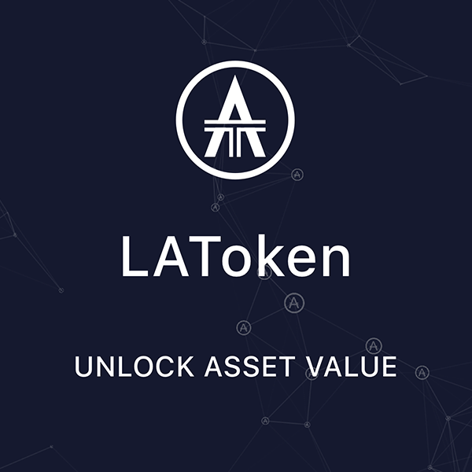

# LA Token Contracts

[](https://coveralls.io/github/BlockchainLabsNZ/LAToken-Contracts-Audit?branch=master) [](https://travis-ci.org/BlockchainLabsNZ/LAToken-Contracts-Audit)

The smart contracts for the [LA Token][latoken] token (LAT) crowdsale.



## Contracts

Please see the [contracts/](contracts) directory.

## Develop

Contracts are written in [Solidity][solidity] and tested using [Truffle][truffle] and [testrpc][testrpc].

### Install

```bash
# Install dependencies:
$ npm install
```

### Test
```bash
$ npm test
```

[latoken]: https://latoken.com/

[solidity]: https://solidity.readthedocs.io/en/develop/
[truffle]: http://truffleframework.com/
[testrpc]: https://github.com/ethereumjs/testrpc
